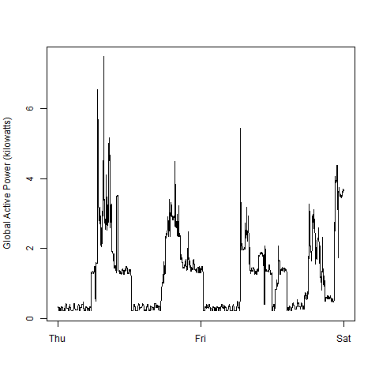

# Assignment 1
## Exploratory Data Analysis
### NoteBook, MVB1
#### Sunday, January 11, 2015


***


####*Data*

##### Read File
* Code
```
HPC1 <- read.table(file="./household_power_consumption.txt", header=TRUE, sep=";", na.strings="?")
str(HPC1)
```

* Output
```
'data.frame':  2075259 obs. of  9 variables:
 $ Date                 : Factor w/ 1442 levels "1/1/2007","1/1/2008",..: 342 342 342 342 342 342 342 342 342 342 ...
 $ Time                 : Factor w/ 1440 levels "00:00:00","00:01:00",..: 1045 1046 1047 1048 1049 1050 1051 1052 1053 1054 ...
 $ Global_active_power  : num  4.22 5.36 5.37 5.39 3.67 ...
 $ Global_reactive_power: num  0.418 0.436 0.498 0.502 0.528 0.522 0.52 0.52 0.51 0.51 ...
 $ Voltage              : num  235 234 233 234 236 ...
 $ Global_intensity     : num  18.4 23 23 23 15.8 15 15.8 15.8 15.8 15.8 ...
 $ Sub_metering_1       : num  0 0 0 0 0 0 0 0 0 0 ...
 $ Sub_metering_2       : num  1 1 2 1 1 2 1 1 1 2 ...
 $ Sub_metering_3       : num  17 16 17 17 17 17 17 17 17 16 ...
```

##### Rename Columns
* Code
```
names(HPC1) <- tolower(names(HPC1))
names(HPC1) <- gsub("_", "", names(HPC1))
names(HPC1) <- gsub("1", "kitchen", names(HPC1))
names(HPC1) <- gsub("2", "laundry", names(HPC1))
names(HPC1) <- gsub("3", "waterheaterairconditioner", names(HPC1))
names(HPC1)
```

* Output
```
[1] "date"                                 "time"                                 "globalactivepower"                   
[4] "globalreactivepower"                  "voltage"                              "globalintensity"                     
[7] "submeteringkitchen"                   "submeteringlaundry"                   "submeteringwaterheaterairconditioner"
```

##### Generate Date Variable
* Code
```
HPC1$date <- as.Date(HPC1$date, format="%d/%m/%Y")
class(HPC1$date)
```

* Output
```
[1] "Date"
```

##### Select Subset
* Code
```
HPC2 <- subset(HPC1, date >= "2007-02-01" & date <= "2007-02-02")
str(HPC2)
```

* Output
```
'data.frame':  2880 obs. of  9 variables:
 $ date                                : Date, format: "2007-02-01" "2007-02-01" "2007-02-01" "2007-02-01" ...
 $ time                                : Factor w/ 1440 levels "00:00:00","00:01:00",..: 1 2 3 4 5 6 7 8 9 10 ...
 $ globalactivepower                   : num  0.326 0.326 0.324 0.324 0.322 0.32 0.32 0.32 0.32 0.236 ...
 $ globalreactivepower                 : num  0.128 0.13 0.132 0.134 0.13 0.126 0.126 0.126 0.128 0 ...
 $ voltage                             : num  243 243 244 244 243 ...
 $ globalintensity                     : num  1.4 1.4 1.4 1.4 1.4 1.4 1.4 1.4 1.4 1 ...
 $ submeteringkitchen                  : num  0 0 0 0 0 0 0 0 0 0 ...
 $ submeteringlaundry                  : num  0 0 0 0 0 0 0 0 0 0 ...
 $ submeteringwaterheaterairconditioner: num  0 0 0 0 0 0 0 0 0 0 ...
```

##### Create Datetime Variable
* Code 
```
if("chron" %in% rownames(installed.packages()) == FALSE) {
  message("Package 'chron' is not installed")
  datetime <- paste(HPC2$date, HPC2$time)
  HPC2$datetime <- strptime(datetime, format="%Y-%m-%d %H:%M:%S")
  HPC2$time <- as.character(HPC2$time)
  str(HPC2)
} else {
  message("Package 'chron' is installed")
  library(chron)
  datetime <- paste(HPC2$date, HPC2$time)
  HPC2$datetime <- strptime(datetime, format="%Y-%m-%d %H:%M:%S")
  HPC2$time <- times(format(HPC2$datetime, "%H:%M:%S"))
  str(HPC2)
}
```

* Output
```
Package 'chron' is installed
'data.frame':  2880 obs. of  10 variables:
 $ date                                : Date, format: "2007-02-01" "2007-02-01" "2007-02-01" "2007-02-01" ...
 $ time                                :Class 'times'  atomic [1:2880] 0 0.000694 0.001389 0.002083 0.002778 ...
  .. ..- attr(*, "format")= chr "h:m:s"
 $ globalactivepower                   : num  0.326 0.326 0.324 0.324 0.322 0.32 0.32 0.32 0.32 0.236 ...
 $ globalreactivepower                 : num  0.128 0.13 0.132 0.134 0.13 0.126 0.126 0.126 0.128 0 ...
 $ voltage                             : num  243 243 244 244 243 ...
 $ globalintensity                     : num  1.4 1.4 1.4 1.4 1.4 1.4 1.4 1.4 1.4 1 ...
 $ submeteringkitchen                  : num  0 0 0 0 0 0 0 0 0 0 ...
 $ submeteringlaundry                  : num  0 0 0 0 0 0 0 0 0 0 ...
 $ submeteringwaterheaterairconditioner: num  0 0 0 0 0 0 0 0 0 0 ...
 $ datetime                            : POSIXlt, format: "2007-02-01 00:00:00" "2007-02-01 00:01:00" "2007-02-01 00:02:00" "2007-02-01 00:03:00" ...
```


***


####*Plots*
* Plot 1
```
png(filename="plot1.png", width=480, height=480, bg="transparent")
hist(HPC2$globalactivepower, main="Global Active Power", xlab="Global Active Power (kilowatts)", ylab="Frequency", col="red")
dev.off()
```


* Plot 2
```
png(filename="plot2.png", width=480, height=480, bg="transparent")
plot(HPC2$datetime, HPC2$globalactivepower, type="l", xlab="", ylab="Global Active Power (kilowatts)")
dev.off()
```


* Plot 3
```
png(filename="plot3.png", width=480, height=480, bg="transparent")
plot(HPC2$datetime, HPC2$submeteringkitchen, type="n", xlab="", ylab="Energy sub metering")
  lines(HPC2$datetime, HPC2$submeteringkitchen, col="black")
  lines(HPC2$datetime, HPC2$submeteringlaundry, col="red")
  lines(HPC2$datetime, HPC2$submeteringwaterheaterairconditioner, col="blue")
  legend("topright", legend=c("Sub_metering_1", "Sub_metering_2", "Sub_metering_3"), lty=1, col=c("black", "red", "blue"))
dev.off()
```


* Plot 4
```
png(filename="plot4.png", width=480, height=480, bg="transparent")
par(mfcol=c(2,2))
plot(HPC2$datetime, HPC2$globalactivepower, type="l", xlab="", ylab="Global Active Power", cex=0.9)
plot(HPC2$datetime, HPC2$submeteringkitchen, type="n", xlab="", ylab="Energy sub metering", cex=0.9)
  lines(HPC2$datetime, HPC2$submeteringkitchen, col="black")
  lines(HPC2$datetime, HPC2$submeteringlaundry, col="red")
  lines(HPC2$datetime, HPC2$submeteringwaterheaterairconditioner, col="blue")
  legend("topright", bty="n", cex=0.9, legend=c("Sub_metering_1", "Sub_metering_2", "Sub_metering_3"), lty=1, col=c("black",         "red", "blue"))
plot(HPC2$datetime, HPC2$voltage, type="l", xlab="datetime", ylab="Voltage", cex=0.9)
plot(HPC2$datetime, HPC2$globalreactivepower, type="l", xlab="datetime", ylab="Global_reactive_power", cex=0.9)
dev.off()
```


***
